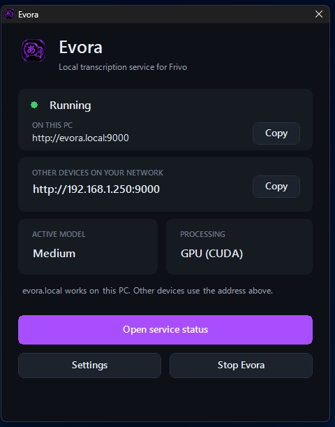

# Evora

Evora is Frivo's private, local speech-to-text service for Windows. It runs
the transcription model on your computer, or on another Windows PC on your
trusted local network, so the audio Frivo sends to it does not need to go to a
cloud transcription service.

Evora is an optional companion to [Frivo](https://github.com/Friday7352/Frivo).
It provides the local OpenAI-compatible `/v1/audio/transcriptions` address
that Frivo uses while listening.



## How Evora works with Frivo

1. Frivo listens to the audio source you selected.
2. Frivo sends each audio clip to Evora over your computer or private network.
3. Evora transcribes the clip locally and returns text to Frivo.
4. Frivo displays that text and, if you enabled translation, uses the
   translation provider you chose in Frivo.

Evora keeps transcription local. Frivo's chat or translation provider is
separate: it can be a local Ollama model or a cloud provider, depending on
your Frivo settings.

## Install Evora

1. Download **EvoraSetup.exe** from the latest GitHub release.
2. Run setup and follow the Evora setup screens.
3. If Frivo will connect from another PC, choose the option to allow private
   network access. Otherwise, leave it off.
4. Leave **Launch Evora after setup finishes** selected if you want to open
   the launcher immediately.

The first setup installs Evora's isolated Python 3.11 environment and the
required transcription packages. On its first start, Evora downloads the
selected speech model. This can take a few minutes and requires an internet
connection.

The launcher shows whether the service is running, the current model, and the
addresses Frivo can use. It also lets you start or stop the service, open the
service-status page, and change settings.

## Connect Frivo

1. Start Evora from its desktop shortcut, Start Menu entry, or launcher.
2. In Frivo, open **Settings** > **Providers** > **Transcription** and select
   **Evora**.
3. Copy the address from the Evora launcher and use **Test** in Frivo.

Use one of these addresses:

| Where Frivo runs | Address to use |
| --- | --- |
| On the same PC as Evora | `http://evora.local:9000` |
| On another PC in your trusted network | The **Other devices on your network** address shown by Evora, such as `http://192.168.x.x:9000` |

If the launcher does not show a network address, open Evora's settings and
allow private-network access. Only do this on a network you trust.

## Updates, repair, and uninstall

Running `EvoraSetup.exe` again detects an existing installation:

- **Update Evora** keeps the selected setup options and downloaded models.
- **Repair Evora** rebuilds the private Python environment and GPU libraries
  while keeping downloaded models.
- **Uninstall Evora** removes the app, service, shortcuts, private-network
  rule, and local address. It can keep downloaded models and GPU libraries to
  make a later reinstall faster.

## Requirements

Evora supports 64-bit Windows 10 and Windows 11. It works on the CPU by
default. A supported NVIDIA GPU is used automatically when its CUDA runtime
is available, which makes transcription much faster. AMD and Intel graphics
hardware use CPU transcription.

## Privacy and local data

Evora stores its runtime, downloaded models, speaker-labelling model, and
logs on the computer where it is installed. Those generated files are not
included in this repository. Evora does not require an API key.

## Building from source

Run the following from PowerShell:

```powershell
powershell -ExecutionPolicy Bypass -File build\Build-EvoraInstaller.ps1
```

The single-file installer is created at `dist\EvoraSetup.exe`.

## Third-party notices

Evora includes [THIRD_PARTY_NOTICES.txt](THIRD_PARTY_NOTICES.txt) with the
license notices for its transcription dependencies. A copy is placed in the
Evora installation folder during setup.
